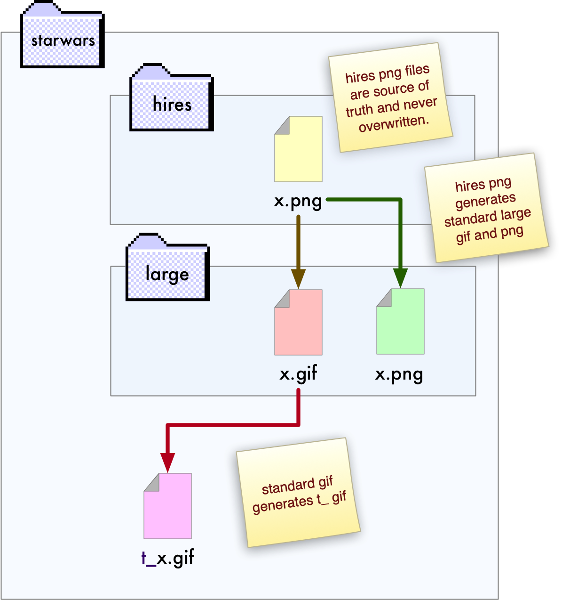

Upload Card Images
==================

* This git repo is the source of truth for **ALL** SWCCG card images.
* This git repo uploads card images to `res.starwarsccg.org`, the SWCCG CDN.
* The card images on `res.starwarsccg.org` are used by all SWCCG services, including: **scomp**, **gemp**, and `holotable.exe`


## Card Images

* Images are in the `Images-HT/starwars/` subdirectory.
  * Subdirectories within `starwars` contain sets, 1 for each side of the force. For example:
    - `EnhancedPremiere-Dark`
    - `EnhancedPremiere-Light`
  * Within the set directories, there are _very small_ **gif** images, each with a filename prefix of `t_`.<br />For example: `t_hanwithheavyblasterpistol.gif`
  * Within the set directories, the `large/` directory contains _large_ **gif** images.
  * Within the set directories, the `hires/` directory contains _high resolution_ **png** images. The holotable app has no knowledge of the png images within the `hires/` directory.
* Card images are used by: **Holotable**, **GEMP**, and **SCOMP**.
* Card images are served from `res.starwarsccg.org/cards`.
* Card images are automatically uploaded to `res.starwarsccg.org/cards` when merging to the `main` branch.


## Image Dimensions

Images used by **Holotable** are small and large. There are two sizes of large images. The newer large size is to accomodate larger screens and a desire to actually be able to read the text on a card.

* **Small *(`t_`)* Images**: 67x87 RGB 72dpi gif
* **_Old_ Large Images**: 350x490 RGB 72dpi gif
* **Standard Large Images**: 745x1039 RGB 120dpi gif
* **High Resolution Images**: 703×980 RGB 120dpi png, *or better*


## Automatic Image Creation

* `holotable.exe` uses the `t_*.gif` images and the `large/*.gif` images.
* All images will be generated automatically from High Resolution images uploaded to the `hires/` subdirectory. **Images in the large directory can be, and WILL BE, overwritten from new images in the `hires` directory.**




### All downstream images are generated automatically by `ImageMagick`

```bash
convert -quality 72 -resize 67x87 large/FILENAME.gif t_FILENAME.gif
```


## Filename CaSe

* All image files should be stored as _lowercase_ to avoid confusion and conflict.


